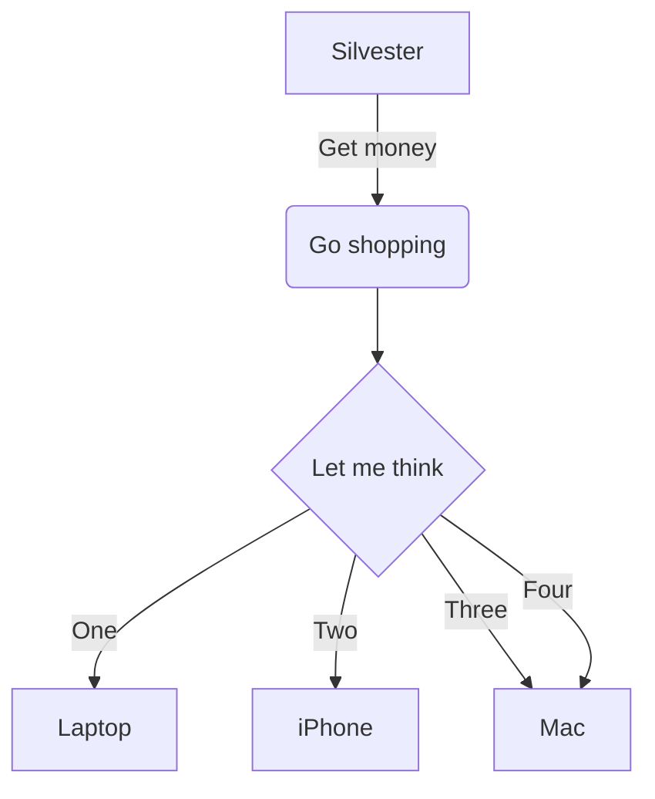

# Skipper


## Overview

Skipper is an HTTP router and reverse proxy software written in Golang.
It has two goals:

* To handle huge amount of concurrent HTTP routes.
* To provide descent ways of HTTP routes configurations.

## Use

* It can route requests to different destinations based on the request metadata, such as HTTP method, path, query parameters, headers, etc.
* It can modify requests and responses.
* It can stream requests and responses.
* It can hot-reload routing rules.
* It can serve as a static file server.
* It can serve as Kubernetes Ingress controller.

## Concepts

### HTTP Proxy

An HTTP proxy is a middleman in-between HTTP client and HTTP server.

With the HTTP proxy software running,

1. The client sends a request to the proxy first.
2. Then, the proxy forwards the request to the server.
3. Afterward, the server sends the response to the proxy.
4. Finally, the proxy receives the response and forwards back to the client.

```
         1           2
CLIENT <---> PROXY <---> SERVER
         4           3
```

### Route

In networking, a route is a path for traffic in a network, or between or cross multiple networks.  In Skipper, the route is an entry in a table, which defines where should the request be proxied to.

A route consists of below information.

* One or more predicates, which are for finding a path for the request.
* One or more filters, which are for modifying the request and the response.
* The target, which can be a backend HTTP server, or solely handled by Skipper.

Below is the simplified Go code.

```go
type Route struct {
    // The preprocessed custom predicate instances.
    Predicates []Predicate
    // The preprocessed filter instances.
    Filters []*RouteFilter
    // The backend scheme and host.
    Scheme, Host, Path string
    ...
}
```

### Routing Table

The routing table stores all routes. It's a list in the memory.

### Predicates

Predicates are tools in a route for matching a request.

For example, below route has three predicates matching designated host, method, and path.

```
foo:
    Host("enqueuezero.com")
    && Method("GET")
    && Path("/concrete-architecture/skipper.html")
    -> "http://0.0.0.0:8080/";
```

Except host, method, and path, predicates can also match headers, cookies, time frames, query parameters, source IP addresses, etc.

### Filters

Filters are tools in a route for modifying the request and the response.

For example, below route has a filter adding a header to the request before proxying to the backend HTTP.

```
foo: * -> setRequestHeader("X-Routed-By", "skipper") -> "https://enqueuezero.com";
```

Except adding header to the request, there are dozens of built-in functions for different features, such as dropping headers, modifying path, redirection, setting static directory, etc.

### Scripts

Skipper has a built-in LUA engine for running scripts as filters.

For example, below script set a header to the request.

```lua
function request(ctx, params)
    ctx.request.header["X-Routed-By"] = "skipper"
end
```

You can either load a file in the file system or use inline lua code in the routes.

```
foo: * -> lua("/path/to/script.lua") -> "https://enqueuezero.com";
bar: * -> lua("function request(c, p); print(c.request.url); end");
```

### Plugins

Plugins are dynamic linked libraries in the plugin directories, for example, `$cwd/example-plugin.so`. Any file with the suffix `.so` found in the plugin directories will be loaded.

The plugins are not in the core code of skipper. To get a `.so` file, as a plugin developer, you need to use `go build` like below.

```bash
$ GO111MODULE=on go build -buildmode=plugin -o example.so example.go
```

### Data Clients

Data clients are for pulling routes from various sources, such as static files, dynamic Kubernetes ingress objects, etc.



## Layered Architecture

## Route Processing

## Request Evaluation

https://godoc.org/github.com/zalando/skipper/routing#hdr-Request_Evaluation

## Matching Conditions

https://godoc.org/github.com/zalando/skipper/routing#hdr-Matching_Conditions

## Conclusions
